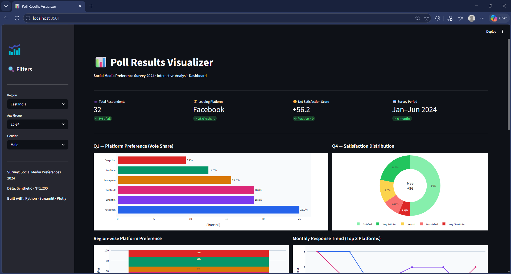
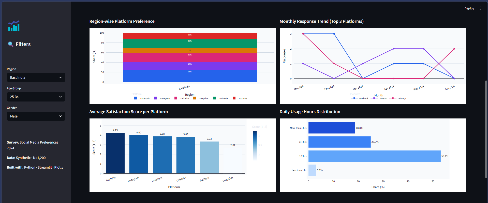
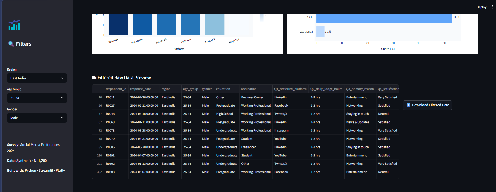

# 📊 Poll Results Visualizer

> A production-grade data analysis pipeline that transforms raw poll/survey data into actionable insights through statistical analysis and compelling visualizations.

[](https://python.org)
[](https://pandas.pydata.org)
[](https://plotly.com)
[](https://streamlit.io)
[](LICENSE)

---

## 🔍 Problem Statement

Organizations collect thousands of survey responses but lack the tools to quickly extract insights. Raw CSV exports from Google Forms or survey tools are difficult to interpret without proper preprocessing and visualization. Analysts need a repeatable, automated pipeline that takes messy poll data → clean analysis → clear visual insights.

## 💡 Solution

A complete end-to-end Python pipeline that:
1. **Generates** realistic synthetic poll data (or accepts real CSV exports)
2. **Cleans** and validates the dataset automatically
3. **Analyzes** vote shares, demographic breakdowns, satisfaction scores
4. **Visualizes** everything with 9 publication-quality charts
5. **Summarizes** key findings as an executive report
6. **Provides** an interactive Streamlit dashboard for non-technical stakeholders

---

## 🎯 Use Cases

| Domain | Application |
|---|---|
| **Market Research** | Product preference analysis across demographics |
| **HR Analytics** | Employee satisfaction survey processing |
| **Political Polling** | Election poll result visualization |
| **Education** | Classroom/event feedback analysis |
| **Business Intelligence** | Customer NPS and sentiment tracking |

---

## 🏗️ Architecture

```
Poll Data Input (CSV / Synthetic)
        │
        ▼
┌─────────────────────┐
│   generate_data.py  │  ← Synthetic data with realistic distributions
└─────────────────────┘
        │
        ▼
┌─────────────────────┐
│    preprocess.py    │  ← Cleaning, null handling, encoding, feature eng.
└─────────────────────┘
        │
        ▼
┌─────────────────────┐
│     analysis.py     │  ← Vote share, crosstabs, NSS, trends
└─────────────────────┘
        │
        ▼
┌─────────────────────┐
│    visualize.py     │  ← 9 charts (bar, donut, heatmap, trend, dashboard)
└─────────────────────┘
        │
        ▼
┌─────────────────────┐
│    dashboard.py     │  ← Interactive Streamlit app with filters
└─────────────────────┘
        │
        ▼
outputs/ → charts, reports, filtered data
```

---

## 📁 Project Structure

```
Poll-Results-Visualizer/
│
├── data/
│   ├── poll_data_raw.csv         ← Auto-generated synthetic data
│   └── poll_data_clean.csv       ← After preprocessing
│
├── notebooks/
│   └── analysis_notebook.ipynb  ← Full step-by-step Jupyter analysis
│
├── src/
│   ├── generate_data.py          ← Synthetic data generator
│   ├── preprocess.py             ← Data cleaning pipeline
│   ├── analysis.py               ← Statistical analysis functions
│   └── visualize.py              ← Chart generation engine
│
├── outputs/
│   ├── charts/                   ← All generated PNG charts
│   └── reports/
│       └── summary_report.txt    ← Executive summary text
│
├── images/                       ← Screenshots for README
│
├── dashboard.py                  ← Streamlit interactive dashboard
├── main.py                       ← Single entry point (run everything)
├── requirements.txt
└── README.md
```

---

## ⚙️ Tech Stack

| Category | Tool |
|---|---|
| Data Manipulation | Python 3.10+, Pandas 2.0, NumPy |
| Static Visualization | Matplotlib, Seaborn |
| Interactive Visualization | Plotly |
| Dashboard | Streamlit |
| Analysis | Custom statistical pipeline |
| Dev Environment | Jupyter Notebook |

---

## 🚀 Quick Start

### 1. Clone the Repository
```bash
git clone https://github.com/YOUR_USERNAME/Poll-Results-Visualizer.git
cd Poll-Results-Visualizer
```

### 2. Create Virtual Environment
```bash
# Windows
python -m venv venv
venv\Scripts\activate

# Mac / Linux
python3 -m venv venv
source venv/bin/activate
```

### 3. Install Dependencies
```bash
pip install -r requirements.txt
```

### 4. Run the Full Pipeline
```bash
python main.py
```

This automatically:
- Generates `data/poll_data_raw.csv` (1,200 synthetic respondents)
- Cleans it → `data/poll_data_clean.csv`
- Runs all analysis
- Generates 9 charts in `outputs/charts/`
- Saves summary report in `outputs/reports/`

### 5. Launch Interactive Dashboard
```bash
streamlit run dashboard.py
```
Open `http://localhost:8501` in your browser.

### 6. Open the Jupyter Notebook
```bash
jupyter notebook notebooks/analysis_notebook.ipynb
```

---

## 📊 Generated Charts

| Chart | File | Description |
|---|---|---|
| Vote Share Bar | `01_vote_share_bar.png` | Horizontal bar — overall platform preference |
| Vote Share Donut | `02_vote_share_donut.png` | Donut chart with total respondents in center |
| Region Stacked | `03_region_stacked_bar.png` | 100% stacked bar by region |
| Age Heatmap | `04_age_group_heatmap.png` | Platform × Age Group heatmap |
| Monthly Trend | `05_monthly_trend.png` | Line chart of responses over 6 months |
| Satisfaction | `06_satisfaction_by_platform.png` | Avg satisfaction score per platform |
| Usage Hours | `07_usage_distribution.png` | Daily social media usage breakdown |
| Dashboard | `08_executive_dashboard.png` | 4-panel summary overview |
| Reason Heatmap | `09_reason_by_platform_heatmap.png` | Platform × Primary reason heatmap |

---
## Dashboard output 




## 📈 Key Findings (Sample)

- **Instagram** leads platform preference with ~28% share across all regions
- **YouTube** is the strongest in South India (driven by content consumption)
- **Net Satisfaction Score: +34** — strong positive sentiment overall
- Users aged **13–24** overwhelmingly prefer Instagram (40%+)
- Users aged **45+** show highest preference for Facebook (50%+)
- LinkedIn users report the **highest satisfaction scores** (professional value)

---

## 🔧 Using Real Data (Google Forms)

1. Export your Google Form responses as CSV
2. Place the CSV in `data/poll_data_raw.csv`
3. Adjust column names in `src/preprocess.py` to match your schema
4. Run `python main.py`

---

## 🗺️ Future Improvements

- [ ] Real-time polling via API (SurveyMonkey, Typeform API)
- [ ] NLP sentiment analysis on open-ended text responses
- [ ] Power BI / Tableau connector
- [ ] Automated email report delivery
- [ ] Multi-survey comparison feature
- [ ] Deploy Streamlit dashboard to Streamlit Cloud

---

## 👨‍💻 Author

**Seethaka Rakshitha**  
Data Science Portfolio Project | Built for Placement/Internship Readiness  

---

## 📄 License

MIT License — free to use, fork, and build upon.
